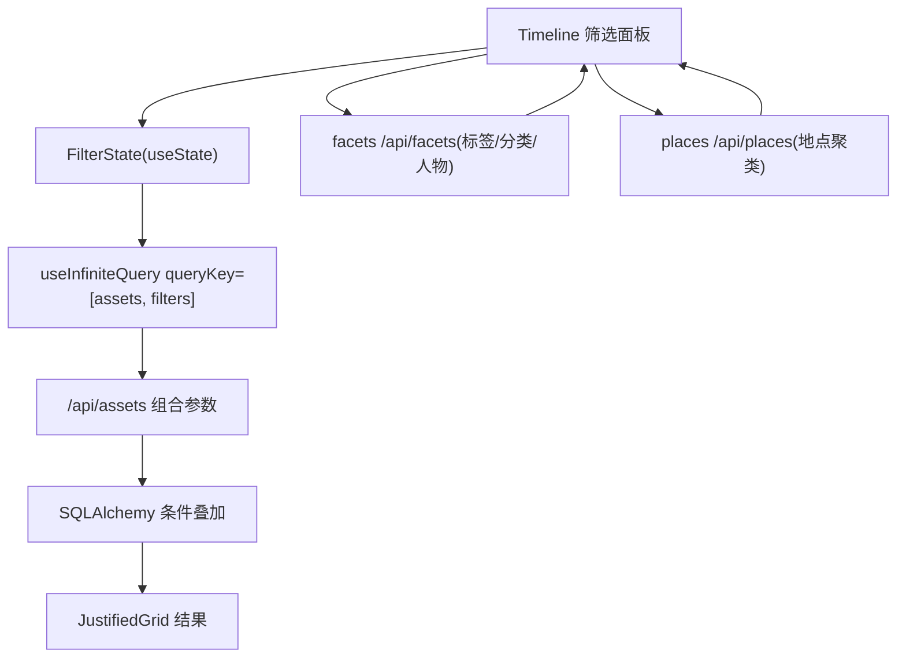

# v1 高级筛选（组合条件过滤 + 日期/地点后端支持）

Feature Name: v1-advanced-filters
Updated: 2026-08-07

## Description

时间轴页增加可展开的组合筛选面板。后端 `/api/assets` 在现有 `media_type` / `favorite` / `tag` / `category` / `person_id` 基础上补充 `taken_after` / `taken_before`（日期范围）与 `place`（地点聚类）过滤。前端把时间轴顶部筛选区升级为面板，条件以 AND 叠加，结果继续用 `JustifiedGrid` + `useInfiniteQuery` 展示。

## Architecture



- 后端改动集中在 `hometrove/api/routes/assets.py` 的 `list_assets`。
- 前端改动集中在 `web/src/routes/timeline.tsx`（新增 `FilterPanel` 子组件）与 `web/src/lib/api.ts`。

## Components and Interfaces

### 1. 后端：`/api/assets` 新增参数

在 `list_assets` 签名追加：

- `taken_after: Optional[int] = Query(None, ge=0)` — `Asset.taken_at >= taken_after`。
- `taken_before: Optional[int] = Query(None, ge=0)` — `Asset.taken_at < taken_before`。
- `place: Optional[str] = Query(None, pattern="^-?\\d+\\.?\\d*,-?\\d+\\.?\\d*$")` — 聚类网格坐标 `"lat,lon"`。

过滤实现：

```python
if taken_after is not None:
    stmt = stmt.where(Asset.taken_at >= taken_after)
if taken_before is not None:
    stmt = stmt.where(Asset.taken_at < taken_before)
if place is not None:
    lat_s, lon_s = place.split(",")
    key = _cluster_key(float(lat_s), float(lon_s), places._GRID)
    ids = _place_ids(session, key)
    facet_ids = ids if facet_ids is None else (facet_ids & ids)
```

### 2. 后端：地点资产查询 `_place_ids`

在 `assets.py` 新增辅助函数，复用 `places._cluster_key` 与 `places._GRID`：

- 扫描 `exif` 插件结果，解析 `metadata.gps_lat` / `metadata.gps_lon`；
- 对每个资产按 `_cluster_key(lat, lon, _GRID)` 对齐，收集落入给定网格中心的资产 id；
- 仅统计 `status == "ok"` 且资产未软删除的结果。

实现对齐 `hometrove/smart_albums.py` 的 `_place_ids`（保证「网格中心坐标 → 资产」的判定一致）。

### 3. 前端：`FilterState` 与查询键

```ts
interface FilterState {
  mediaType?: string;
  favFilter: "all" | "favorites" | "unfavorites";
  takenAfter?: string;   // yyyy-mm-dd
  takenBefore?: string;  // yyyy-mm-dd
  personId?: number;
  place?: string;        // "lat,lon" 或空
  tag?: string;
}
```

- `queryKey: ["assets", JSON.stringify(filterState)]` 或结构化数组，任一条件变化都触发重查。
- 日期 → epoch：`new Date(`${date}T00:00:00`).getTime()/1000`（after）与 `new Date(`${date}T23:59:59`).getTime()/1000`（before）。

### 4. 前端：`FilterPanel`

- 收纳现有媒体类型按钮与收藏筛选（保持行为），新增：
  - 日期范围：两个 `<input type="date">`；
  - 人物：`<select>`，选项来自 `useQuery(["persons"])`；
  - 地点：`<select>`，选项来自 `useQuery(["places"])` 的 `items`（显示 `lat,lon · count`，值为 `grid`）；
  - 标签：`<select>`，选项来自 `useQuery(["facets"])` 的 `tags`；
- 「清除全部」按钮重置 `FilterState`。
- 面板默认折叠；「筛选」按钮切换展开/收起；有激活条件时按钮显示数量徽标。

### 5. 前端：`api.assets` 签名扩展

```ts
assets: (cursor?, filters: AssetsFilter = {}) => request<AssetPage>(`/assets?...`)
```

- 现有 `(cursor, mediaType, facets, favoriteParam)` 调用点迁移到统一 `filters` 对象；`timeline.tsx` 是唯一调用点（其他页面如 `facet.tsx` 若调用需同步）。

## Data Models

- 无新增表。复用现有 `Asset.taken_at`、`exif` 插件结果（`metadata.gps_lat/gps_lon`）、`FaceEmbedding.person_id`、`PluginResult`（`mock.tags` / `mock.category`）。
- 前端新增 `AssetsFilter` 类型与 `FilterState`。

## Correctness Properties

- 所有筛选条件对最终结果集取 **AND**（交叠），`facet_ids` 集合求交集逻辑保持不变。
- 日期边界：`taken_after` 含端点（`>=`），`taken_before` 不含（`<`），避免重叠一天。
- 地点判定必须与 `places` / `smart_albums` 使用同一 `_GRID=0.5` 与 `_cluster_key`，保证「地图点选的地点在筛选里命中相同资产」。
- 查询键变化必须触发 `useInfiniteQuery` 重置并清空已加载页，防止旧条件结果混入。

## Error Handling

- 非法日期/地点参数由 FastAPI `Query` 校验返回 422（pattern + ge 约束）。
- `/api/facets` 或 `/api/places` 加载失败：筛选面板对应下拉显示「加载失败」，不阻塞时间轴主列表。
- 标签无数据：面板隐藏标签选择器并显示「暂无标签」。

## Test Strategy

- 后端新增测试（`tests/test_smoke.py`）：
  1. `taken_after`/`taken_before` 过滤正确，含边界（>= / <）；
  2. `place` 参数命中网格单元内资产，非法格式返回 422；
  3. 组合条件（media_type + person_id + tag）叠加过滤正确；
  4. 日期/地点与其他条件（favorite）组合。
- 前端：`npm run build` 通过（TypeScript 类型检查）。
- 后端全量回归保持全绿（114 → 预计 118+）。

## References

- 现有 `list_assets` `hometrove/api/routes/assets.py#L134`
- 现有 `_facet_asset_ids` / `_person_asset_ids` `hometrove/api/routes/assets.py#L31`
- 网格聚类 `hometrove/api/routes/places.py#L26`（`_cluster_key`）、`hometrove/smart_albums.py`（`_place_ids` 对齐实现）
- 前端时间轴 `web/src/routes/timeline.tsx`、API 封装 `web/src/lib/api.ts`
