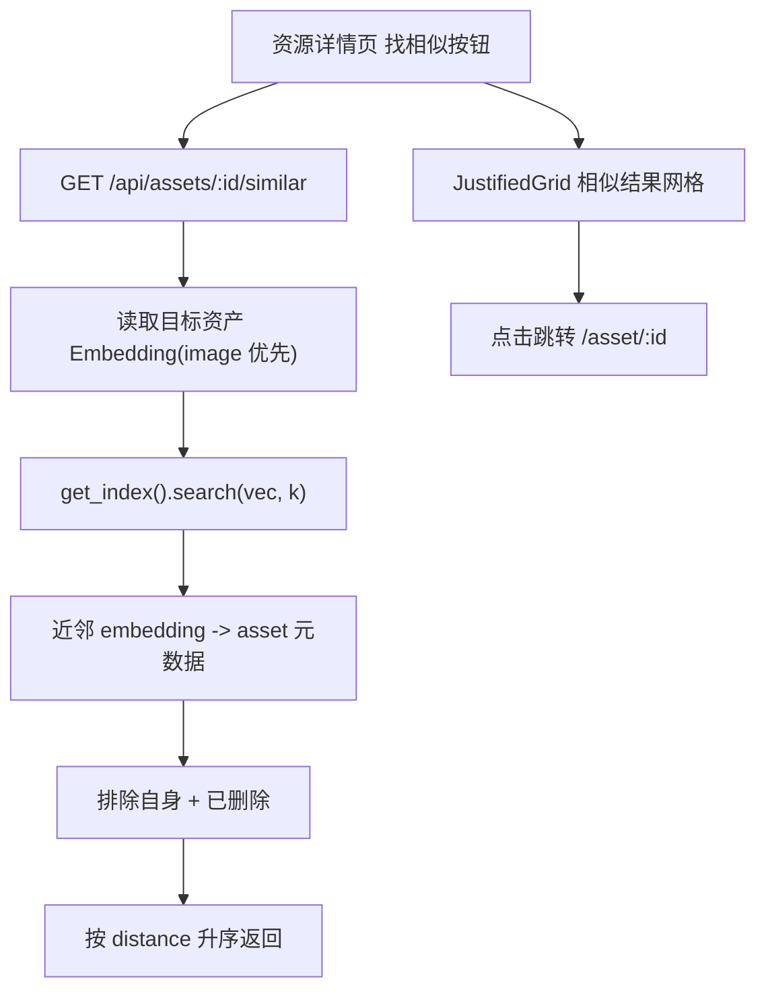

# v1 以图搜图（资产向量近邻召回）

Feature Name: v1-image-similarity
Updated: 2026-08-07

## Description

利用现有 `embedding.jina_clip` 向量管道（`embeddings` 表 + `embedding_vec` sqlite-vec 索引）实现「从某资产出发找相似」。后端新增 `GET /api/assets/{asset_id}/similar`，前端在资源详情页提供「找相似」按钮与结果网格。全程复用现有向量搜索能力，不引入新依赖。

## Architecture



## Components and Interfaces

### 1. 后端：`similar` 查询函数（`hometrove/search.py`）

新增 `similar_assets(session, asset_id, k)` 复用 `_vector_recall` 的模式：

```python
def similar_assets(session: Session, asset_id: int, k: int = 24) -> list[dict]:
    # 1) 目标资产存在性 / 软删除检查（调用方在路由层做 404 判断）。
    # 2) 取目标资产 embeddings，scope 优先 image，其次任意 scene。
    emb = session.execute(
        select(Embedding).where(
            Embedding.asset_id == asset_id,
            Embedding.plugin_id == "embedding.jina_clip",
        ).order_by(case((Embedding.scope == "image", 0), else_=1), Embedding.id)
    ).scalars().first()
    if emb is None:
        return []
    vec = json.loads(emb.embedding_json)
    # 3) 近邻搜索。
    try:
        rows = get_index().search(vec, k=k)
    except Exception:
        return []
    # 4) 排除自身、已删除；组装 DTO。
    ...
```

- 排序优先级：`image` scope 优先（整图语义），无 image 时用最近一条 scene（首场景）。
- 用目标向量自身做查询时，最相似项几乎必是自身 → 显式排除 `asset_id == 目标`。
- 近邻用 `Embedding.id` 反查 `Asset`，过滤 `deleted_at IS NOT NULL`。

### 2. 后端：路由（`hometrove/api/routes/assets.py`）

```python
@router.get("/assets/{asset_id}/similar", summary="Find visually similar assets")
def similar_assets_endpoint(
    asset_id: int,
    limit: int = Query(24, ge=1, le=100),
    session: Session = Depends(get_db),
):
    a = session.get(Asset, asset_id)
    if a is None or a.deleted_at is not None:
        raise HTTPException(404, "asset not found")
    return {"asset_id": asset_id, "items": similar_assets(session, asset_id, limit)}
```

每个 item：

```json
{
  "asset_id": 42,
  "media_type": "image",
  "duration_sec": null,
  "distance": 0.42,
  "scope": "image",
  "t_start": null,
  "t_end": null
}
```

### 3. 前端：API 封装（`web/src/lib/api.ts`）

```ts
export interface SimilarHitDTO {
  asset_id: number;
  media_type: string;
  duration_sec: number | null;
  distance: number;
  scope: string;
  t_start: number | null;
  t_end: number | null;
}
similar: (id: number, limit = 24) =>
  request<{ asset_id: number; items: SimilarHitDTO[] }>(`/assets/${id}/similar?${new URLSearchParams({ limit: String(limit) })}`),
```

### 4. 前端：资源详情页（`web/src/routes/asset_detail.tsx`）

- 在非回收站状态的按钮组里新增「找相似」按钮（`useQuery`，`enabled` 为点击后）。
- 结果区在按钮下方渲染 `SimilarGrid`：与 `search.tsx` 的 `HitCard` 样式一致的缩略图网格；点击跳 `/asset/{id}`；视频命中显示时间窗；空态显示说明。
- 复用 `thumbUrl`、`mediaLabel`；不引入新组件库。

## Data Models

- 无新增表。复用 `embeddings`（`asset_id`/`scope`/`t_start`/`t_end`/`embedding_json`）与 `embedding_vec` 索引。
- 前端新增 `SimilarHitDTO` 类型。

## Correctness Properties

- 返回列表**排除目标资产自身**与所有已软删除资产。
- 目标资产 404 判定与既有 `/api/assets/{id}` 一致（不存在或 `deleted_at` 非空）。
- 距离升序（sqlite-vec 原生返回），同一资产只出现一次（以 embedding 去重后取首个）。
- 无向量 / 索引不可用时返回空列表而非报错，保持 200 语义。

## Error Handling

- 目标资产不存在或已软删除：404（`asset not found`）。
- `embedding_vec` 索引缺失或查询抛错：捕获后返回空列表。
- 目标资产无嵌入向量：返回空列表（前端显示「暂无相似资产」空态）。

## Test Strategy

- 后端新增测试（`tests/test_smoke.py`）：
  1. 为目标资产写入 image embedding → `/similar` 返回该资产自身被排除、其余按距离升序；
  2. 无 embedding 的目标资产返回空列表；
  3. 不存在 / 已软删除的目标资产返回 404；
  4. 结果排除已软删除近邻。
- 前端：`npm run build` 通过 + `npx tsc --noEmit` 零错误。
- 后端全量回归保持全绿（117 → 预计 120+）。

## References

- 向量管道 `hometrove/vector.py`（`get_index()` / `search` / `VECTOR_DIM`）
- 嵌入插件 `hometrove/plugins/builtin/embedding_clip.py`（scope 语义）
- 现有混合搜索召回 `hometrove/search.py`（`_vector_recall` 模式）
- 搜索页缩略图网格 `web/src/routes/search.tsx`（`HitCard` 样式复用）
- 资源详情页 `web/src/routes/asset_detail.tsx`
