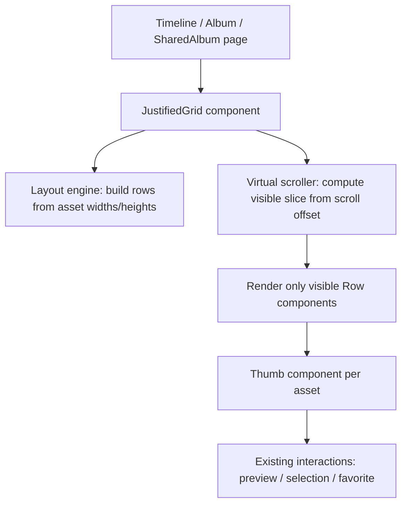

# Justified Grid + Virtual Scrolling

Feature Name: v1-justified-grid-virtual-scroll  
Updated: 2026-08-07

## Description

Refactor the timeline, album detail, and shared album thumbnail grids from a fixed `aspect-[4/3]` CSS grid into a justified, row-based virtual scroller. Each row is packed to a uniform target height while filling the available width. Only visible rows (plus a buffer) are mounted in the DOM, so libraries with many thousands of items remain responsive. All existing interactions—lightbox preview, selection mode, favorite toggle, and bulk actions—continue to work unchanged.

## Architecture

## Components and Interfaces

### `JustifiedGrid`

A reusable React component that accepts a flat list of assets and renders them in a justified virtual grid.

Props:

| Prop | Type | Description |
|---|---|---|
| `assets` | `AssetDTO[]` | All items to lay out. |
| `targetRowHeight` | `number` | Desired row height in pixels. Default `200`. |
| `gap` | `number` | Gap between thumbnails in pixels. Default `4`. |
| `overscan` | `number` | Extra rows to render above/below viewport. Default `3`. |
| `renderThumb` | `(asset: AssetDTO, style: ThumbStyle) => ReactNode` | Render function for each cell. |
| `onRowVisible` | `(rowIndex: number) => void` | Optional callback when a row enters view. |
| `empty` | `ReactNode` | Content shown when `assets` is empty. |

`ThumbStyle` carries precomputed absolute position/size styles so the thumb component needs only apply them.

### Layout engine

A pure function `buildLayout(assets, containerWidth, targetRowHeight, gap) -> Row[]`.

- Each asset contributes a scaled width `targetRowHeight * aspect` (default aspect 4:3 when dimensions unknown).
- Assets are greedily added to the current row until adding the next asset would exceed `containerWidth`.
- The last row is stretched to fill `containerWidth` if it has more than one asset.
- A single asset that is wider than the container is scaled down to fit.
- Each `Row` contains: `top`, `height`, `width`, `items: LayoutItem[]`. Each `LayoutItem` contains: `asset`, `left`, `top` (always 0 within row), `width`, `height`, `scale`.

The layout is recomputed whenever `containerWidth` or `assets` changes.

### Virtual scroller

- A scrollable container with `overflow-y: auto` and `position: relative`.
- Total height = sum of all row heights + gaps.
- A spacer element inside the container sets the scrollable height.
- Visible rows are derived from `scrollTop`, viewport height, `overscan`, and row positions.
- The visible slice is absolutely positioned using each row's precomputed `top`.

### Thumb rendering

Each thumb receives `style: { position: 'absolute', left, top, width, height }` and renders:

- `` with `thumbUrl(asset.id)` and `loading="lazy"`.
- Video/placeholder and duration overlays from existing `Thumb` component.
- Selection badge and favorite star overlays.
- Click handlers for preview/selection and favorite toggle.

## Data Models

No backend data model changes are required. The component reuses the existing `AssetDTO` fields `width`, `height`, `media_type`, `duration_sec`, and `favorite`.

## Correctness Properties

1. Every rendered thumbnail preserves its original aspect ratio.
2. Every row fills the container width unless it contains a single item that is already narrower.
3. The virtual scroller's total scroll height exactly matches the sum of laid-out row heights.
4. Scrolling to a specific row always places that row at the correct offset.
5. Resizing the window recomputes the layout but does not reset scroll position or selection state.
6. The component is read-only with respect to `assets`; mutations (favorite toggle) are applied via the parent page's query cache.

## Error Handling

| Scenario | Handling |
|---|---|
| Asset has no width/height | Use default 4:3 aspect ratio. |
| Container width is zero (e.g. hidden tab) | Skip layout until a non-zero width is measured. |
| Thumbnail image fails to load | Hide the image; the cell still occupies its layout space. |

## Test Strategy

Add or update tests in the existing backend suite only where API behavior changes (none expected). Frontend visual behavior is verified by:

1. Rendering the timeline with a mix of landscape/portrait assets and confirming no horizontal overflow.
2. Scrolling a long timeline and confirming only a subset of rows is mounted at once.
3. Resizing the window and confirming the layout recalculates.
4. Verifying that lightbox, selection, and favorite interactions still work after the refactor.

## Dependencies

No new runtime dependencies. The layout and virtualization are implemented with React hooks and native DOM measurements (`ResizeObserver`, `scroll` events).

## References

- `web/src/routes/timeline.tsx` - current timeline grid and interactions
- `web/src/routes/albums.tsx` - current album detail grid
- `web/src/routes/shared_album.tsx` - current shared album grid
- `web/src/components/bulk_actions.tsx` - selection state and bulk bar
- `web/src/lib/api.ts` - `AssetDTO` shape and API helpers
