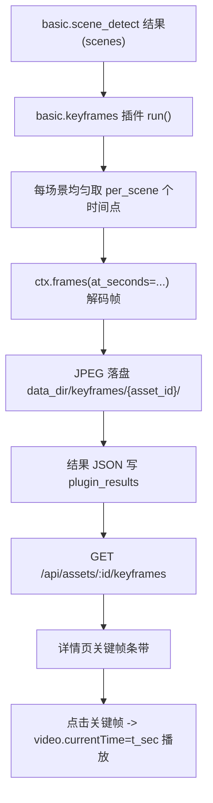

# v1 关键帧抽取（每场景 N 张，N 可配置）

Feature Name: v1-keyframe-extraction
Updated: 2026-08-07

## Description

对视频资产基于 `basic.scene_detect` 的场景切分结果，为每个场景抽取 `per_scene` 张关键帧，落盘 `{data_dir}/keyframes/{asset_id}/`，记录每帧时间戳。后端新增 `basic.keyframes` 插件 + `GET /api/assets/{id}/keyframes`（列表）与 `GET /api/assets/{id}/keyframes/{scene}/{index}`（图片）；前端在视频详情页展示关键帧条带，点击跳转到对应秒播放。不引入新依赖（复用 PyAV + Pillow + scene_detect 结果）。

## Architecture



## Components and Interfaces

### 1. 后端：`basic.keyframes` 插件（`hometrove/plugins/builtin/keyframes.py`）

```python
class KeyframesPlugin(BasePlugin):
    id: str = "basic.keyframes"
    name: str = "视频关键帧"
    version: str = "0.1.0"
    supported_media: set[str] = {MediaType.VIDEO.value}
    depends_on: list[str] = ["basic.info", "basic.scene_detect"]

    class ParamsModel(BaseModel):
        per_scene: int = 1      # keyframes per scene
        max_scenes: int = 48    # cap scenes processed per video
        max_side: int = 640     # longest edge of output JPEG
        quality: int = 85
```

`run()` 流程：

1. 非视频资产 → `skipped`；源文件缺失 → `skipped`。
2. 从 `ctx.result_of("basic.scene_detect")` 读 `scenes`（`start`/`end`/`keyframe`）；无结果时视为单个场景 `[0, duration]`。
3. 对每个场景（最多 `max_scenes` 个）：
   - `per_scene==1`：时间点为 `keyframe`（或场景中点）。
   - `per_scene>1`：在 `[start, end]` 内均匀分布 `per_scene` 个点。
4. 收集全部时间点调用 `ctx.frames(at_seconds=times)`（共享缓存，复用 embedding/thumbnail 的解码）。
5. 每帧用 Pillow 缩放到 `max_side` 内并写 JPEG 到 `out_dir = data_dir/keyframes/{asset_id}/scene-{i}-{j}.jpg`。
6. 返回 `{status, scene_count, total, keyframes:[{scene, index, t_sec, t_start, t_end, file}]}`。

解码失败（无 `av`/Pillow/视频损坏）→ `skipped`，不抛异常。

### 2. 后端：路由（`hometrove/api/routes/assets.py`）

```python
@router.get("/assets/{asset_id}/keyframes")
def asset_keyframes(asset_id, session):
    # 404 for unknown/trashed; read basic.keyframes plugin_result (ok)
    # return {"asset_id", "items": [{scene, index, t_sec, url}]}
    # url = f"/api/assets/{asset_id}/keyframes/{scene}/{index}"

@router.get("/assets/{asset_id}/keyframes/{scene}/{index}")
def asset_keyframe_file(asset_id, scene, index, session):
    # 404 if asset unknown/trashed; serve file or 404
    # FileResponse(data_dir/keyframes/{asset_id}/scene-{scene}-{index}.jpg)
```

- 列表接口读取 `plugin_results` 中 `basic.keyframes` 的 `status=="ok"` 结果；无结果 → 空列表。
- 图片接口直接按路径服务文件（`scene`/`index` 为 `int` 路径参数，天然防穿越）。

### 3. 前端：API 封装（`web/src/lib/api.ts`）

```ts
export interface KeyframeDTO {
  scene: number;
  index: number;
  t_sec: number;
  url: string;
}
keyframes: (id: number) =>
  request<{ asset_id: number; items: KeyframeDTO[] }>(`/assets/${id}/keyframes`),
keyframeUrl: (id: number, scene: number, index: number) =>
  `/api/assets/${id}/keyframes/${scene}/${index}`,
```

### 4. 前端：视频详情页关键帧条带（`web/src/routes/asset_detail.tsx`）

- 仅当资产为视频且非回收站状态时查询 `api.keyframes(id)`。
- 在 `<video>` 下方渲染横向滚动条带（`overflow-x-auto`），每帧缩略图 ``，hover 高亮并显示 `t_sec` 时间。
- 点击关键帧 → 通过 `useRef` 拿到 `<video>` DOM，设置 `currentTime = t_sec` 并 `play()`（原生 controls 已含）。
- 关键帧为空或加载失败 → 不渲染条带区域。

## Data Models

- 无新表。复用 `plugin_results`（`basic.keyframes`，JSON 含 keyframes 元数据）与 `{data_dir}/keyframes/{asset_id}/` 落盘文件。
- 前端新增 `KeyframeDTO` 类型。

## Correctness Properties

- 关键帧时间戳落在所属场景 `[start, end]` 内。
- `per_scene` 受 `max_scenes` 限制，总帧数有界（防恶意参数造成解码风暴）。
- 落盘幂等：重复运行覆盖同名文件与结果行。
- 解码/依赖缺失一律 `skipped`，绝不污染作业流为 `failed`。

## Error Handling

- 资产不存在或已软删除：列表与图片接口均 404。
- 无场景切分结果：整个视频按单窗口兜底抽取。
- 视频无法解码 / 缺少 `av` / `Pillow`：插件 `skipped`；列表接口返回空。
- 图片文件缺失：图片接口 404。

## Test Strategy

- 后端新增测试（`tests/test_smoke.py`）：
  1. 插件对视频产出 `per_scene` 张关键帧，文件落盘且时间戳在场景范围内；
  2. 无 scene_detect 结果时的单窗口兜底；
  3. 非视频资产 `skipped`；视频解码失败 `skipped`；
  4. 列表接口：返回关键帧、无结果空列表、未知/软删资产 404；
  5. 图片接口：返回 JPEG、缺失文件 404。
- 前端：`npm run build` 通过 + `npx tsc --noEmit` 零错误。
- 后端全量回归保持全绿（121 → 预计 126+）。

## References

- 场景切分插件 `hometrove/plugins/builtin/scene_detect.py`（scenes 元数据）
- 缩略图插件 `hometrove/plugins/builtin/thumbnail.py`（PyAV 解码 + Pillow 落盘模式）
- 共享解码缓存 `hometrove/plugins/api.py`（`ctx.frames(at_seconds=...)`）
- 详情页 `web/src/routes/asset_detail.tsx`
- 视频构造辅助 `tests/test_smoke.py::_make_video` / `_make_scene_video`
