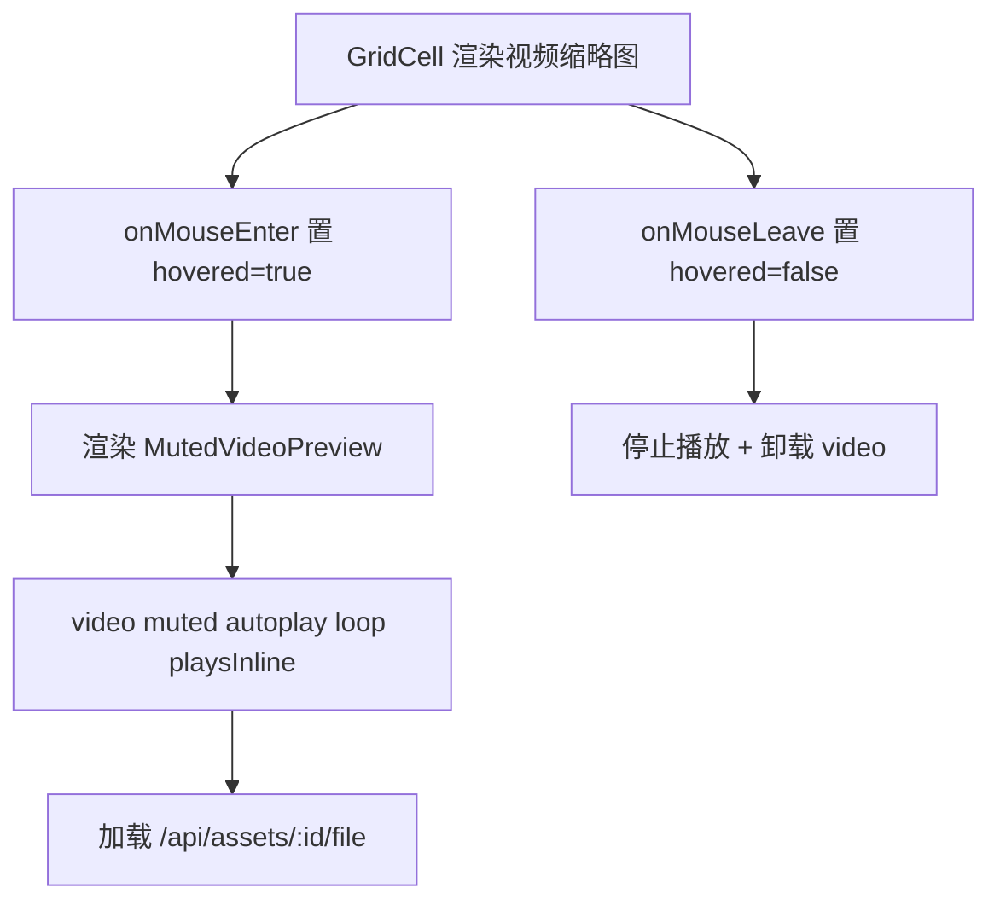

# v1 视频栅格内静音预览播放（桌面 hover）

Feature Name: v1-muted-preview
Updated: 2026-08-07

## Description

时间轴 justified 网格中的视频缩略图支持桌面 hover 静音原地预览：鼠标悬停时用 `<video muted autoplay loop playsInline>` 播放，离开即停止。复用 `/api/assets/{id}/file` 视频流，纯前端、无后端改动、无新依赖。

## Architecture



## Components and Interfaces

### 1. 通用组件 `MutedVideoPreview`（`web/src/components/muted_preview.tsx`）

自包含的预览组件，接受 `assetId`，在挂载后渲染一个绝对定位覆盖的静音 `<video>`：

```tsx
export function MutedVideoPreview({ assetId }: { assetId: number }) {
  const [failed, setFailed] = useState(false);
  if (failed) return null;
  return (
    <video
      src={`/api/assets/${assetId}/file`}
      muted
      loop
      autoPlay
      playsInline
      preload="auto"
      onError={() => setFailed(true)}
      className="absolute inset-0 h-full w-full object-cover"
    />
  );
}
```

- 只在父级认为「需要播放」时才被渲染（条件挂载），移出后由父级卸载，浏览器自然停止解码。
- `muted` 保证浏览器允许自动播放；`playsInline` 避免 iOS 全屏。
- `onError` → 置 `failed` 后返回 `null`，缩略图保持可见。

### 2. 接入点：`GridCell`（`web/src/routes/timeline.tsx`）

- 在 `GridCell` 中增加 `hovered` 状态，`onMouseEnter` / `onMouseLeave` 控制。
- 仅当 `asset.media_type === "video"` 且 `hovered` 时渲染 `<MutedVideoPreview assetId={asset.id} />`，置于缩略图 `img` 之上（同层 `absolute inset-0`，z 覆盖图片但低于选中/收藏标识）。
- 预览层 `pointer-events-none`，保证鼠标事件仍落到单元按钮上（点击/选择/收藏不受影响）。
- 视频无法播放时组件自行 `failed`，不干扰缩略图。

## Data Models

- 无新增数据模型 / 接口 / 表。仅前端组件与交互。

## Correctness Properties

- 只有被悬停的视频单元才挂载 `<video>`，未悬停单元不加载视频数据。
- 离开悬停即卸载组件，浏览器释放解码资源，不影响虚拟滚动。
- 图片资产与「其他」类型不渲染预览。
- hover 预览不阻断既有点击、选择、收藏交互（预览层 `pointer-events-none`）。

## Error Handling

- 浏览器拒绝自动播放：`muted` 已满足自动播放策略；若仍失败由浏览器静默处理。
- 视频解码失败 / 文件缺失：`onError` → 隐藏预览，缩略图可见。

## Test Strategy

- 纯前端交互，无后端 API 变更；全量后端测试保持全绿（125）。
- 前端 `npm run build` 通过 + `npx tsc --noEmit` 零错误。
- 手动验证：桌面浏览器悬停视频缩略图 → 静音播放；移开 → 停止；点击/选择/收藏不受影响；图片不播放。

## References

- 时间轴网格 `web/src/routes/timeline.tsx`（`GridCell`）
- justified 网格容器 `web/src/components/justified_grid.tsx`
- 视频流接口 `/api/assets/{id}/file`（`hometrove/api/routes/assets.py::asset_file`）
