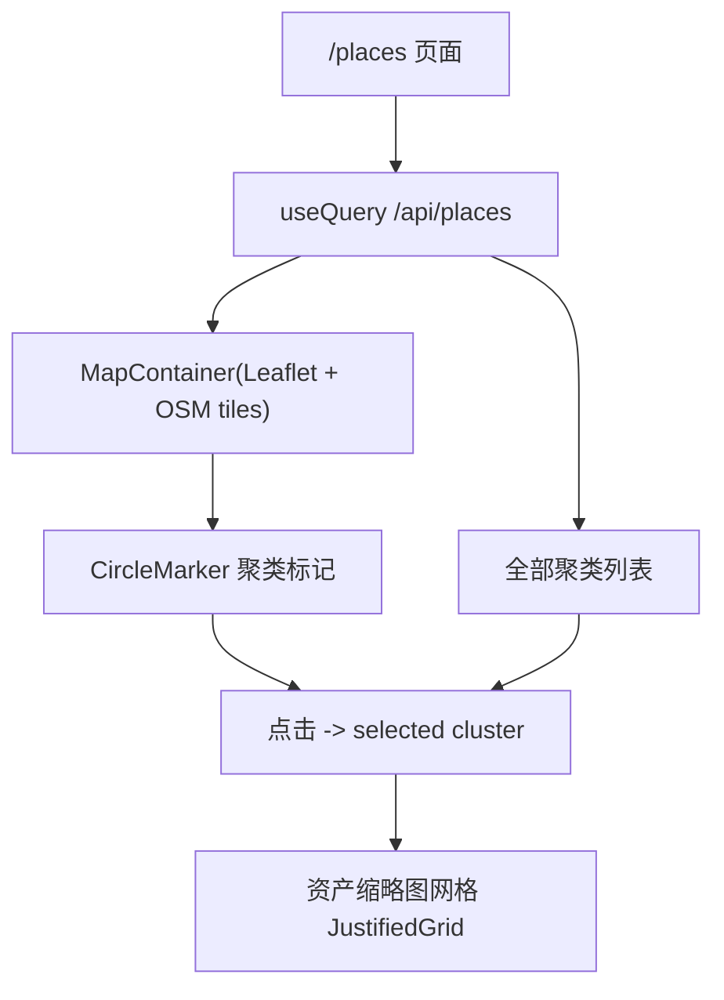

# v1 地点地图（Leaflet + OpenStreetMap 交互式地图视图）

Feature Name: v1-place-map
Updated: 2026-08-07

## Description

将 M1-8 已交付的 `/api/places` 静态 SVG 散点地图升级为 Leaflet + OpenStreetMap 交互式地图。后端聚类 API 无需改动；改动集中在前端 `/places` 页面：引入 `leaflet` + `react-leaflet`（v5，兼容 React 19），用真实地图替换等距圆柱投影，保留聚类列表与资产缩略图网格。

## Architecture

- 后端 `/api/places`（`hometrove/api/routes/places.py`）保持原样：`grid` 参数、聚类均值坐标、`count`、`asset_ids` 均已就绪。
- 前端新增依赖：`leaflet@1.9.x`、`react-leaflet@5.0.x`、`@types/leaflet`（dev）。

## Components and Interfaces

### 1. 地图容器（`web/src/routes/places.tsx` 改造）

- 使用 `MapContainer` + `TileLayer` 加载 OSM 瓦片：
  - `url="https://tile.openstreetmap.org/{z}/{x}/{y}.png"`
  - `attribution` 保留 OSM 版权署名（OSM 使用条款要求）。
- 初始视图：`center` 取全部聚类经纬度均值（或第一个聚类），`zoom` 设为 3；`useMap` 在聚类变化时 `flyTo` 适应范围。
- 容器高度固定（如 `h-[450px]`），外层保留现有圆角边框样式。

### 2. 聚类标记（`ClusterMarkers` 子组件）

- 使用 `react-leaflet` 的 `CircleMarker`：
  - `center={[c.lat, c.lon]}`，`radius` 由 `count` 决定（`4 + (count / max) * 12`，与现状一致）。
  - `pathOptions` 按选中态切换颜色（indigo 系，与现有主题一致）。
  - `eventHandlers={{ click: () => onSelect(key) }}`。
- 标记内显示 `count`：用 `Tooltip`（permanent）展示数量。

### 3. 资产缩略图网格（沿用现有 `ClusterAssets`）

- 保持现有逻辑：按 `asset_ids.slice(0, 24)` 用 `useQueries` 拉资产、`thumbUrl` 渲染缩略图、点击跳 `/asset/{id}`。
- 后续如需展示全部资产，可改为点击聚类时基于 `asset_ids` 分页请求 `/api/assets` 过滤（当前保持 24 张上限，满足 v1）。

### 4. 聚类列表（保留）

- 「全部聚类」chip 列表保留，选中态与地图标记联动：点击列表项调用 `onSelect(key)`，`selected` state 统一驱动地图标记与列表高亮。

### 5. 地图容器高度与 SSR

- 项目为纯 CSR（Vite + React SPA），无 SSR，Leaflet 初始化无 window 兼容问题。
- CSS：`leaflet/dist/leaflet.css` 从 `main.tsx` 或本组件 import。

## Data Models

- 前端 `PlaceCluster` 类型（`web/src/lib/api.ts`）无需改动：
  - `grid: [number, number]`、`lat: number`、`lon: number`、`count: number`、`asset_ids: number[]`。

## Correctness Properties

- 地图标记的经纬度与 `/api/places` 返回的 `lat`/`lon` 一一对应，不允许前端再做投影换算。
- 选中态在「地图标记」与「聚类列表」间单一来源：均读写同一个 `selected` state。
- OSM 瓦片仅用于展示；`attribution` 必须保留，满足 OSM 政策。
- 地图容器必须有显式高度，否则 Leaflet 无法渲染（常见坑）。

## Error Handling

- `/api/places` 请求失败：沿用 react-query `isError` 分支，显示错误提示 + 重试按钮。
- 无聚类数据：保留现有空态提示（不渲染地图容器）。
- 瓦片加载失败：Leaflet 静默降级为空白底图，不影响标记渲染；不额外处理（公共瓦片服务偶发）。

## Test Strategy

- 后端无改动，现有 114 测试应保持全绿。
- 前端验证：
  - `npm run build` 通过（TypeScript 类型检查 + 打包）。
  - 手动/预览验证：有 GPS 数据时地图渲染、缩放平移、点击标记显示资产网格；无数据时空态；列表与地图联动。

## References

- 后端聚类实现 `hometrove/api/routes/places.py`
- 现有地点页 `web/src/routes/places.tsx`
- react-leaflet v5（React 19 兼容）：`npm view react-leaflet@5.0.0 peerDependencies` 确认 `leaflet ^1.9.0` / `react ^19.0.0`
