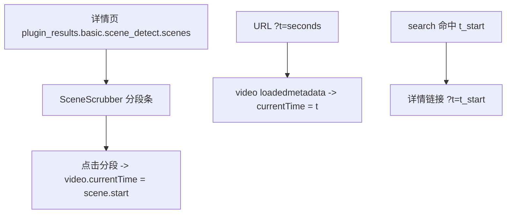

# v1 播放器跳秒（场景切分点 scrubber + `?t=` 跳秒）

Feature Name: v1-seek-playback
Updated: 2026-08-07

## Description

补齐 v1 视频「播放器跳秒」能力：(1) 视频详情页播放器叠加场景切分点 scrubber，点击分段跳转到场景起点；(2) 详情页支持 `?t=seconds` URL 参数自动跳秒；(3) 搜索结果「详情」链接携带命中场景 `t_start`。纯前端能力，复用既有 `basic.scene_detect` 插件结果（详情页 `plugin_results`）与 `/api/assets/{id}/file` 视频流。

## Architecture



## Components and Interfaces

### 1. 场景分段条 `SceneScrubber`（`web/src/routes/asset_detail.tsx` 内联）

从 `asset.plugin_results["basic.scene_detect"].data.scenes` 取场景列表，在播放器下方渲染等比分段条：

```tsx
function SceneScrubber({ scenes, duration, onSeek }: {
  scenes: { start: number; end: number }[];
  duration: number | null;
  onSeek: (t: number) => void;
}) {
  if (!scenes || scenes.length === 0) return null;
  const total = duration ?? scenes[scenes.length - 1].end;
  return (
    <div className="mt-2 flex h-3 w-full overflow-hidden rounded bg-neutral-200 dark:bg-neutral-800">
      {scenes.map((s, i) => (
        <button key={i}
          title={`${formatTime(s.start)}–${formatTime(s.end)}`}
          onClick={() => onSeek(s.start)}
          className="h-full border-r border-white/60 bg-brand-500/70 hover:bg-brand-500"
          style={{ width: `${((s.end - s.start) / (total || 1)) * 100}%` }}
        />
      ))}
    </div>
  );
}
```

- 分段宽度按时长比例；`duration` 取资产 `duration_sec`，缺失时用最后一个场景 `end`。
- 点击任意分段 → 复用 `KeyframeStrip` 相同的 `onSeek` 回调（`currentTime = t; play()`）。

### 2. `?t=` URL 跳秒（`web/src/routes/asset_detail.tsx`）

- `useSearchParams()` 读取 `t`；`videoRef` 上挂 `onLoadedMetadata` handler。
- handler 校验：`t` 为有限正数、`asset.media_type === "video"`、`t < duration`（或 duration 未知）时才 `currentTime = t`。
- 对 `t` 改变触发重新 seek（`useEffect` 依赖 `[t, assetId]`）。

### 3. 搜索结果详情链接（`web/src/routes/search.tsx`）

```tsx
<Link
  to={hit.can_seek && hit.t_start != null
    ? `/asset/${hit.asset_id}?t=${hit.t_start}`
    : `/asset/${hit.asset_id}`}
>
```

## Data Models

- 无新增数据模型 / 接口。复用 `basic.scene_detect` 插件结果（`scenes: [{start, end, keyframe}]`）与 `AssetDetailDTO.plugin_results`。
- 复用 `AssetDTO.duration_sec`。

## Correctness Properties

- 分段条宽度比例与场景时长成正比，总宽对应整段视频。
- `?t=` 仅在视频资产且 t 合法时生效；图片/非法值静默忽略。
- 点击分段与 `?t=` 共用同一 seek 回调，行为一致。

## Error Handling

- 无场景结果 / `duration` 未知：scrubber 隐藏或按最后场景 end 兜底，不报错。
- 浏览器自动播放被拒：`play().catch(() => {})` 吞掉，`controls` 保留供手动播放。
- `?t` 超出时长：跳过（保持 0s 起播）。

## Test Strategy

- 纯前端交互，无后端 API 变更；全量后端测试保持全绿（125）。
- 前端 `npm run build` 通过 + `npx tsc --noEmit` 零错误。
- 手动验证：视频详情页出现场景分段条、点击跳转；`/asset/{id}?t=3` 自动跳到 3s；搜索视频场景命中的「详情」链接带 `?t=`。

## References

- 详情页 `web/src/routes/asset_detail.tsx`（`KeyframeStrip`/`onSeek` 复用）
- 搜索页 `web/src/routes/search.tsx`（详情链接）
- 场景切分插件 `hometrove/plugins/builtin/scene_detect.py`（scenes 元数据）
