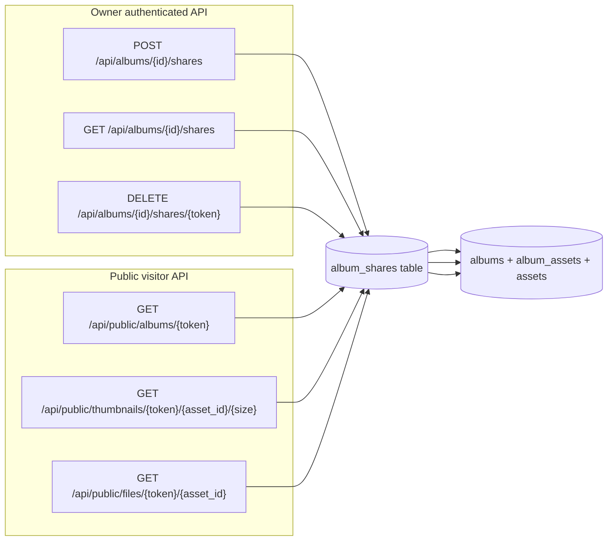

# Shared Albums

Feature Name: v1-shared-albums  
Updated: 2026-08-07

## Description

Expose public, unauthenticated share links for curated albums. Each link is an opaque token stored in the database and carries three owner-configurable flags:

- `allow_original`: visitor may view the original media file.
- `allow_download`: visitor receives original files with a `Content-Disposition: attachment` header.
- `expires_at`: optional Unix epoch after which the link is treated as revoked.

One album may have multiple independent tokens, each revocable without affecting others. Visitors see only live (`deleted_at IS NULL`) album members and cannot access assets outside the shared album.

## Architecture

## Design Decision: Opaque Token vs. Signed URL

Two options were considered for the share URL:

1. **Signed/JWT-style URL**: embed `album_id`, permissions, and expiration in the URL path or query, signed with a server secret. Pro: stateless, no database lookup. Con: long URL, revocation requires a deny-list or short expiry, and changing permissions changes the URL.
2. **Opaque token stored in a table**: the URL contains only a short random token; the server looks up metadata on each request. Pro: short stable URL, instant revocation by deleting the row, easy support for multiple tokens per album, permission/expiration changes do not invalidate the link. Con: requires a database read per request.

HomeTrove chooses **option 2** because album shares are low-frequency reads, revocation and multiple links per album are explicit requirements, and short URLs are preferable for manual sharing.

## Components and Interfaces

### Backend

New module `hometrove/api/routes/shared_albums.py`:

| Route | Auth | Input | Output | Notes |
|---|---|---|---|---|
| `POST /api/albums/{album_id}/shares` | owner | `allow_original: bool`, `allow_download: bool`, `expires_at: int | null` | `{token, allow_original, allow_download, expires_at, created_at, share_url}` | Token generated with `secrets.token_urlsafe(32)`. |
| `GET /api/albums/{album_id}/shares` | owner | - | `{items: [...]}` | Only non-expired links returned. |
| `DELETE /api/albums/{album_id}/shares/{token}` | owner | - | `{ok: true}` | 404 if token does not belong to album. |
| `GET /api/public/albums/{token}` | none | - | album DTO + `asset_ids` | 404 for expired/revoked/unknown tokens. |
| `GET /api/public/thumbnails/{token}/{asset_id}/{size}` | none | `size` | image bytes / placeholder | 404 if asset not in album or trashed. |
| `GET /api/public/files/{token}/{asset_id}` | none | - | original file bytes | 403 if `allow_original=false`; 404 if asset not in album or trashed. |

Authenticated routes reuse the existing `albums` router prefix and `require_auth` dependency (the default v1 passthrough backend returns `is_authenticated=false`, so v1 uses `current_principal` plus an ownership check against the single `local` principal). Public routes have **no auth middleware gating** but still resolve a principal for logging/rate-limiting.

### Frontend

- New route `/share/:token` rendered by `web/src/routes/shared_album.tsx`.
- The public page fetches `/api/public/albums/{token}` and displays the album title, description, and a thumbnail grid.
- Clicking a thumbnail opens a read-only lightbox using the existing `AssetDetail` components; edit/favorite/trash/bulk buttons are hidden.
- Album detail page (`/albums/:id`) gains a "分享" button that opens a modal to create a link with toggles for "允许查看原图" and "允许下载原图" and an optional expiration picker. The created link is shown with a copy-to-clipboard button.
- A list of active share links is shown in the same modal, each with a "撤销" button.

## Data Models

### New table: `album_shares`

| Column | Type | Constraints | Notes |
|---|---|---|---|
| `id` | `Integer` | PK | Surrogate key for internal use. |
| `album_id` | `Integer` | FK `albums.id` ON DELETE CASCADE, NOT NULL | Shared album. |
| `token` | `Text` | UNIQUE, NOT NULL | Opaque public token. |
| `allow_original` | `Integer` | NOT NULL DEFAULT 0 | 1 = visitor may view original. |
| `allow_download` | `Integer` | NOT NULL DEFAULT 0 | 1 = browser download header. |
| `expires_at` | `Integer` | nullable | Epoch seconds; NULL means no expiration. |
| `created_at` | `Integer` | NOT NULL DEFAULT `_now()` | Token creation time. |
| `created_by` | `Text` | NOT NULL DEFAULT `"local"` | Principal id for v1.1 multi-user. |

Indexes:

- `idx_album_shares_album` on `album_id`
- `idx_album_shares_token` on `token` (unique index)

### Relationships

- `Album` gains `shares: Mapped[list["AlbumShare"]]` with `cascade="all, delete-orphan"` so deleting an album invalidates all its links.
- `AlbumShare` references `Album` via `album_id`.

## Correctness Properties

1. A share link never exposes assets outside its album.
2. Trashed assets are always excluded from public album views and public media endpoints.
3. `allow_download=true` implies `allow_original=true` at the storage level, but the API still checks `allow_original` for file access and only adds the attachment header when `allow_download=true`.
4. Expired tokens are treated identically to revoked tokens (404).
5. Token generation uses the cryptographic RNG (`secrets.token_urlsafe`) to prevent guessing.
6. Public file endpoints stream or send the on-disk file directly; they do not perform transcoding, preserving M0 read-only guarantees.

## Error Handling

| Scenario | HTTP | Detail |
|---|---|---|
| Album not found (owner routes) | 404 | "album not found" |
| Token not found / expired / revoked | 404 | "share not found or expired" |
| Token exists but does not match requested album (delete) | 404 | "share not found" |
| Asset not in shared album | 404 | "asset not found in share" |
| Asset in album but trashed | 404 | "asset not found in share" |
| Original access disabled | 403 | "original access not allowed" |
| Invalid boolean / expiration payload | 422 | Pydantic validation error |

## Test Strategy

Add tests in `tests/test_smoke.py` covering:

1. Create share link returns a token and share URL.
2. List shares returns only non-expired links.
3. Revoke link makes public endpoints return 404.
4. Public album endpoint returns live assets in album order.
5. Trashed asset is excluded from public view.
6. Public thumbnail returns bytes for an album asset and 404 for non-member assets.
7. Public original file returns 200 when `allow_original=true` and 403 when `false`.
8. Public original file returns `Content-Disposition: attachment` when `allow_download=true`.
9. Expired token returns 404 on all public endpoints.
10. Deleting an album cascades and deletes its share tokens.

## References

- `hometrove/models.py` - `Album`, `AlbumAsset`, `Asset` definitions
- `hometrove/api/routes/albums.py` - existing album CRUD
- `hometrove/api/__init__.py` - router registration order
- `hometrove/auth.py` - `Principal` and `require_auth`
