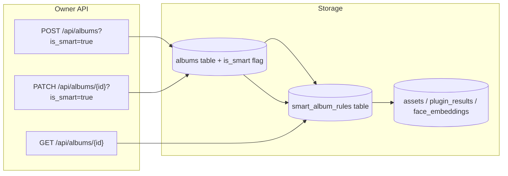

# Smart Albums

Feature Name: v1-smart-albums  
Updated: 2026-08-07

## Description

A smart album is a saved filter expression that the server re-evaluates on every read. It behaves like a manual album from the user's point of view: it appears in the album list, has a cover, a description, and a detail page. Internally it has no `album_assets` rows; instead it stores a JSON rule that is translated into a SQL query.

v1 keeps the rule DSL intentionally small: `and`/`or` combinators plus leaf operators for person, place, tag, category, time range, media type, and favorite. The frontend exposes the rules as a simple form rather than a visual editor.

## Architecture



## Design Decision: Extend `albums` vs Separate `smart_albums`

Two options were considered:

1. **Separate `smart_albums` table**: a dedicated table with its own CRUD and a different DTO shape. Pro: schema isolation. Con: album list/detail must union two tables and handle different behaviors everywhere.
2. **Extend `albums` with `is_smart` and a `smart_album_rules` table**: manual albums stay unchanged; smart albums reuse the same endpoints and DTO. Pro: list/detail/share code paths stay simple; cover/description/name edits work identically. Con: `album_assets` is unused for smart albums.

HomeTrove chooses **option 2** because the user experience of smart albums is intentionally close to manual albums, and keeping one list endpoint minimizes frontend and test duplication.

## Components and Interfaces

### Backend

Extend `hometrove/api/routes/albums.py`:

| Route | Change | Notes |
|---|---|---|
| `GET /api/albums` | Add `is_smart` to each DTO; count is computed for smart albums | Manual albums keep `len(album.items)` |
| `POST /api/albums` | Accept `is_smart: bool = false` and `rule: dict` | Rejects manual album with rule or smart album without rule |
| `GET /api/albums/{id}` | Add `is_smart` and `rule`; smart album returns computed `asset_ids` | Manual album unchanged |
| `PATCH /api/albums/{id}` | Accept `rule` updates when `is_smart=true` | Rejects membership/cover-only changes that conflict |
| `POST /api/albums/{id}/assets` | Return 400 if `is_smart=true` | Smart albums do not support explicit membership |
| `DELETE /api/albums/{id}/assets` | Return 400 if `is_smart=true` | Smart albums do not support explicit membership |

New helper `hometrove/smart_albums.py`:

- `validate_rule(rule: dict) -> None`: recursive check of operator names and required fields.
- `eval_rule(session, rule: dict) -> list[int]`: returns matching live asset ids ordered by `taken_at DESC, id DESC`.
- `smart_asset_ids(session, album_id: int) -> list[int]`: loads rule for album and evaluates it.

### Frontend

- `web/src/routes/albums.tsx`: list cards show a small "智能" badge when `is_smart` is true.
- `web/src/routes/albums.tsx`: create form gains an "智能相册" toggle. When enabled, a rule builder form appears with dropdowns for person/place/tag/category/media type/favorite and date pickers for time range. Support adding nested `and`/`or` groups up to three levels.
- `web/src/routes/albums.tsx`: detail page for smart albums hides add/remove/reorder buttons and shows the rule as a read-only summary.
- `web/src/lib/api.ts`: add `SmartAlbumRule` types, `createSmartAlbum`, `updateSmartAlbumRule` helpers.

## Data Models

### Updated table: `albums`

| Column | Type | Constraints | Notes |
|---|---|---|---|
| `is_smart` | `Integer` | NOT NULL DEFAULT 0 | 1 = rule-based album. |

### New table: `smart_album_rules`

| Column | Type | Constraints | Notes |
|---|---|---|---|
| `album_id` | `Integer` | PK, FK `albums.id` ON DELETE CASCADE | One rule per smart album. |
| `rule_json` | `Text` | NOT NULL | Stored rule expression. |
| `created_at` | `Integer` | NOT NULL DEFAULT `_now()` | Rule creation time. |
| `updated_at` | `Integer` | NOT NULL DEFAULT `_now()` | Last rule update. |

### Rule JSON schema

```json
{
  "op": "and",
  "children": [
    { "op": "person", "person_id": 3 },
    { "op": "time", "after": 1704067200, "before": 1735689600 }
  ]
}
```

Supported operators:

| Operator | Fields | Evaluation |
|---|---|---|
| `and` | `children: list[rule]` | intersection of child results |
| `or` | `children: list[rule]` | union of child results |
| `person` | `person_id: int` | `face_embeddings.person_id` |
| `place` | `place_id: str` | `exif` plugin result GPS inside the place's grid cell |
| `tag` | `value: str` | `mock.tags` result contains value |
| `category` | `value: str` | `mock.category` result contains value |
| `time` | `after?: int`, `before?: int` | `taken_at` inside range (inclusive) |
| `media_type` | `value: "image"|"video"|"other"` | `assets.media_type` |
| `favorite` | `value: bool` | `assets.favorite` |

## Correctness Properties

1. A smart album never includes a trashed asset.
2. A smart album rule is validated before persistence; invalid operators or missing fields return 422.
3. Manual album endpoints for adding/removing/reordering assets reject smart albums with 400.
4. Smart album results are deterministic: same rule + same data always returns same ordered ids.
5. Deleting an album cascades and deletes its rule row.
6. Smart album asset count is computed on read; it may change as the library changes.

## Error Handling

| Scenario | HTTP | Detail |
|---|---|---|
| Smart album without rule | 422 | "smart album requires a rule" |
| Manual album with rule | 422 | "manual album cannot have a rule" |
| Unknown operator | 422 | "unsupported rule operator: ..." |
| Add/remove/reorder on smart album | 400 | "smart album membership is read-only" |

## Test Strategy

Add tests in `tests/test_smoke.py` covering:

1. Create smart album with an `and` rule returns `is_smart=true` and the rule.
2. Smart album returns matching asset ids ordered by `taken_at DESC`.
3. Smart album excludes trashed assets.
4. Manual album add/remove endpoints reject a smart album.
5. Update smart album rule changes the returned assets.
6. Invalid rule operator returns 422.
7. Album list includes manual and smart albums with correct counts.
8. Delete smart album removes the rule row.
9. Nested `or` + `person` + `media_type` returns the expected union/intersection.

## References

- `hometrove/models.py` - `Album`, `Asset`, `FaceEmbedding`, `PluginResult`
- `hometrove/api/routes/albums.py` - existing album CRUD
- `hometrove/api/routes/assets.py` - facet filter helpers
- `hometrove/api/routes/places.py` - place clustering logic
