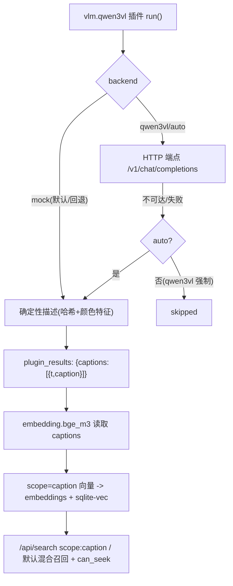

# v1 中文描述（vlm.qwen3vl + caption scope 向量）

Feature Name: v1-vlm-caption
Updated: 2026-08-09

## Description

新增 `vlm.qwen3vl` 插件：对图片生成 1 条中文描述、对视频按 `basic.scene_detect` 场景关键帧逐场景生成带时间戳的描述（`{"captions": [{"t", "caption"}]}`）。真实模型走 HTTP 端点（vLLM/Ollama 等 OpenAI 兼容接口），模型不可用时回退确定性 mock 描述——与 `asr.faster_whisper` 的 `auto|mock|faster_whisper` 双后端模式一致，保证 vanilla 安装即可端到端观察。

随后新增 `embedding.bge_m3` 文本向量插件：读取 `vlm.qwen3vl` 的 captions，逐条编码为 `scope="caption"` 的 1024 维向量写入 `embeddings` + sqlite-vec，并携带 `t_start`/`t_end`。`/api/search` 的 `scope:caption` 前缀与默认混合召回随即可用，视频 caption 命中带 `can_seek` 跳秒。

## Architecture



## Components and Interfaces

### 1. 后端：`vlm.qwen3vl` 插件（`hometrove/plugins/builtin/vlm_qwen3vl.py`）

```python
class VlmQwen3vlPlugin(BasePlugin):
    id: str = "vlm.qwen3vl"
    name: str = "中文描述（Qwen3-VL）"
    version: str = "0.1.0"
    supported_media: set[str] = {MediaType.IMAGE.value, MediaType.VIDEO.value}
    depends_on: list[str] = ["basic.info", "basic.scene_detect"]

    class ParamsModel(BaseModel):
        prompt: str = "请用中文描述这张图片，突出主体、场景、动作、显著细节。"
        max_tokens: int = 256
        temperature: float = 0.2
        backend: str = "auto"          # auto|mock|qwen3vl
        endpoint_url: Optional[str] = None   # 真实 VLM 的 /v1/chat/completions
        endpoint_model: str = "qwen3-vl"     # 发给端点的 model 名
        max_scenes: int = 24                 # 视频场景数上限
```

`run()` 流程：

1. 非图片/视频 → `skipped`；源文件缺失 → `skipped`。
2. 图片：`ctx.image()` 取整图 → 单条 caption（`t=None`）。
3. 视频：`ctx.result_of("basic.scene_detect")` 取 scenes（上限 `max_scenes`）→ `ctx.frames(at_seconds=[s.keyframe...])` → 每场景一条 caption（`t=keyframe`）；无 scenes 时 `t=0.0` 单条兜底。
4. `backend` 分发：`mock` 强制 mock；`qwen3vl` 走 HTTP 端点，失败即 `skipped`；`auto` 优先端点、失败回退 mock。
5. 返回 `{"status": "ok", "backend": "mock|qwen3vl", "captions": [{t, caption}]}`。

- mock 描述 = 确定性哈希（asset id + content_hash + 时间戳 + 图像颜色特征）选择模板与主体词，同一资产重复运行结果一致。
- 真实端点：`POST {endpoint_url}`（OpenAI 兼容 chat/completions），`image_url` 用 base64 data URL；失败/超时/异常 → `None`（`auto` 回退 / `qwen3vl` skip）。
- 模块级 `has_qwen3vl() -> bool`（端点可配置且可探测）与 `_HAS_QWEN3VL` 缓存，供测试注入。

### 2. 后端：`embedding.bge_m3` 插件（`hometrove/plugins/builtin/embedding_bge_m3.py`）

```python
class EmbeddingBgeM3Plugin(BasePlugin):
    id: str = "embedding.bge_m3"
    name: str = "语义向量（描述文本，bge-m3 占位）"
    version: str = "0.1.0"
    supported_media: set[str] = {MediaType.IMAGE.value, MediaType.VIDEO.value}
    depends_on: list[str] = ["basic.info", "vlm.qwen3vl"]

    class ParamsModel(BaseModel):
        dim: int = VECTOR_DIM
        max_captions: int = 24
```

`run()` 流程：

1. `ctx.result_of("vlm.qwen3vl")` 无成功结果 → `skipped`。
2. 幂等：`delete_embeddings(session, asset.id, plugin_id=self.id)`。
3. 对每条 caption（上限 `max_captions`）编码 1024 维单位向量，写入 `Embedding(scope="caption", t_start=caption.t, t_end=caption.t)` + `get_index().upsert`。
4. 返回 `{"status": "ok", "scope": "caption", "vectors": n}`。

- mock 文本编码：`_hash_vec("bge3", asset.id, caption_text, f"t{t}")`（确定性哈希 + 归一化，与 `embedding.jina_clip` 同构）。真实 bge-m3 模型就位后原地替换 `_encode_text`。

### 3. 后端：搜索（`hometrove/search.py`）

- `_strip_scope` 已接受 `caption`。
- `search()` 的已知 scope 白名单从 `(None, "image", "scene", "audio")` 扩为含 `"caption"`，使 `scope:caption` 不再被降级为无 scope。
- `_vector_recall(session, vec, scope="caption")` 已按 `Embedding.scope` 过滤，caption 命中天然携带 `t_start` → `can_seek`。

### 4. 后端：注册（`hometrove/plugins/builtin/__init__.py`）

- `_register_builtins()` 追加 `VlmQwen3vlPlugin()` 与 `EmbeddingBgeM3Plugin()`；`__all__` 同步。

## Data Models

- 无新表。复用 `embeddings` 表（`scope` 列已含 `caption` 语义，见 `models.py` `Embedding` docstring）与 `plugin_results`。
- `embedding_vec` sqlite-vec 索引复用 `get_index().upsert`，caption 向量随 `Embedding` 行同一事务写入。

## Correctness Properties

- 图片 1 条 caption（`t=None`）；视频 caption 数与场景数一致（≤ `max_scenes`）或兜底 1 条。
- mock 输出确定性：同一资产同参数重复运行结果一致。
- caption 向量 `t_start`/`t_end` 与来源场景 keyframe 一致，视频命中 `can_seek=true`。
- 重跑幂等：bge_m3 先删旧 caption 向量再写入。
- 端点不可用：`auto` 回退 mock（保持可观察），`qwen3vl` 明确 `skipped`，绝不抛异常污染作业。

## Error Handling

- 非目标媒体 / 源文件缺失 / 无法解码 → `skipped`。
- 真实端点网络错误、超时、非 2xx、响应缺少 `choices[0].message.content` → 按 `backend` 回退或 `skipped`。
- 无 scene_detect 结果 → 视频按 `t=0.0` 单条兜底。

## Test Strategy

- 后端新增测试（`tests/test_smoke.py`）：
  1. 图片：mock 产出 1 条 caption（`t=None`），确定性（重跑相同）；
  2. 视频：基于 scene_detect 每场景一条 caption，`t` 等于 keyframe；
  3. 无 scene_detect 视频 → `t=0.0` 兜底；
  4. 非目标媒体 / 源缺失 → `skipped`；
  5. `backend="qwen3vl"` 端点不可用 → `skipped`（monkeypatch 注入）；
  6. `embedding.bge_m3` 写入 caption scope 向量（scope/t_start/幂等重跑）；
  7. 无 `vlm.qwen3vl` 结果 → bge_m3 `skipped`；
  8. `scope:caption` 搜索召回且视频命中 `can_seek=true`；
  9. DAG 依赖顺序（vlm → bge_m3）在 `_claim_next` 生效。
- 前端：无改动，描述展示复用详情页 `plugin_results`。
- 后端全量回归保持全绿（125 → 预计 134+）。

## References

- 双后端模式参考 `hometrove/plugins/builtin/asr_faster_whisper.py`（auto|mock|real + `_HAS_*` 探测）。
- 场景消费参考 `hometrove/plugins/builtin/embedding_clip.py`（`ctx.result_of` + `ctx.frames(at_seconds=...)`）。
- 向量写入 `hometrove/vector.py`（`delete_embeddings` / `get_index().upsert`）。
- 搜索 scope 过滤 `hometrove/search.py`（`_strip_scope` / `_vector_recall` / `_keyword_recall`）。
- 注册 `hometrove/plugins/builtin/__init__.py`（`_register_builtins`）。
- 测试辅助 `tests/test_smoke.py`（`make_png` / `_make_scene_video` / `session_scope`）。
