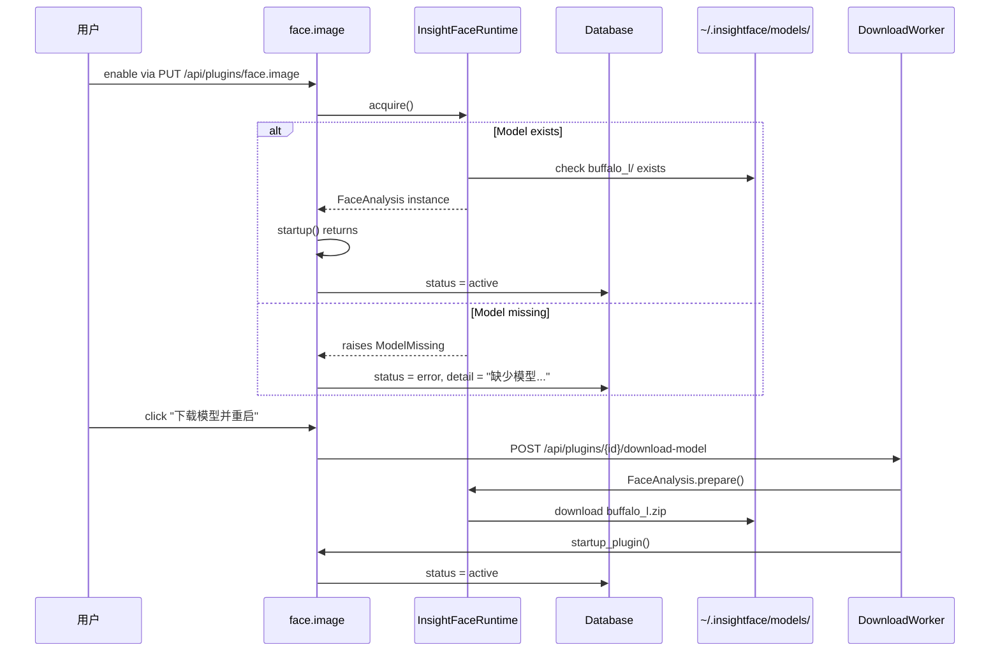

# 人脸识别 v2（三层数据模型 + 双插件架构）

Feature Name: v2-face-recognition
Updated: 2026-08-20

## Description

重构 HomeTrove 的人脸识别管线：

1. **数据模型**：引入"识别组（FaceCluster）"作为中间抽象，将 `Person` 改为用户视角的"人员"顶层抽象；新增 `Face` 记录每张脸（向量、bbox、来源插件）。识别组聚合单插件的多张脸；人员聚合跨插件的多个识别组。
2. **插件架构**：删除 `mock.*` 占位，废弃旧 `face.detect` / `face.match`（标记 stub 停止调度），新增 `face.image`（图片专用）与 `face.video`（视频专用），两者共享同一份内存中的 InsightFace `FaceAnalysis` 实例（引用计数管理）。
3. **插件内自动归组**：每个插件内部按 cosine 相似度自动聚簇出识别组（`min_faces=3` 才生成 `representative_face`）。
4. **模型下载**：插件启动时检测 InsightFace `buffalo_l` 模型缺失即返回 `error` 状态，UI 提供"下载模型并重启"按钮触发 InsightFace 自带的下载机制。
5. **UI 三层下钻**：`/persons`（人员）→ `/persons/{id}`（识别组列表）→ `/persons/{id}/clusters/{cluster_id}`（人脸列表）。

## Architecture

```mermaid
graph TD
    Asset[Asset row] -->|face.image plugin| FaceImage["face.image<br/>InsightFace FaceAnalysis"]
    Asset -->|face.video plugin| FaceVideo["face.video<br/>InsightFace FaceAnalysis"]

    subgraph InsightFaceRuntime [InsightFaceRuntime shared]
        APP[FaceAnalysis singleton<br/>refcount = N]
    end

    FaceImage -->|acquire| APP
    FaceVideo -->|acquire| APP

    FaceImage -->|write| FaceTable[(faces table)]
    FaceVideo -->|write| FaceTable

    FaceTable -->|auto-cluster| ClusterTable[(face_clusters table)]
    ClusterTable -->|person_id FK| PersonTable[(persons table)]

    PersonTable --> PersonsUI[/web /persons/]
    ClusterTable --> ClusterUI[/web /persons/{id}/]
    FaceTable --> FaceUI[/web /persons/{id}/clusters/{id}/]

    SettingsUI[/web /settings/plugins/] -->|download-model| DownloadWorker[Background worker]
    DownloadWorker -->|FaceAnalysis.prepare| InsightfaceCDN[InsightFace CDN]
```



## Components and Interfaces

### 1. InsightFaceRuntime（共享实例管理）

新文件 `hometrove/insightface_runtime.py`：

```python
"""Shared InsightFace FaceAnalysis singleton with refcount.

Two plugins (face.image, face.video) share one underlying FaceAnalysis
instance to avoid double-loading the 280MB buffalo_l pack. Each plugin
calls acquire() at startup() and release() at shutdown(). When the refcount
drops to zero the instance is freed.
"""

from threading import Lock
from typing import Optional

class InsightFaceRuntime:
    _instance: Optional[Any] = None
    _refcount: int = 0
    _lock: Lock = Lock()

    @classmethod
    def acquire(cls, model_name: str = "buffalo_l") -> "FaceAnalysis":
        with cls._lock:
            if cls._instance is None:
                cls._instance = cls._build(model_name)
            cls._refcount += 1
            return cls._instance

    @classmethod
    def release(cls) -> None:
        with cls._lock:
            cls._refcount -= 1
            if cls._refcount <= 0:
                cls._instance = None
                cls._refcount = 0

    @classmethod
    def _build(cls, model_name: str) -> "FaceAnalysis":
        from insightface.app import FaceAnalysis
        app = FaceAnalysis(name=model_name, allowed_modules=["detection", "recognition"], providers=["CPUExecutionProvider"])
        app.prepare(ctx_id=0, det_size=(640, 640))
        return app
```

`face.image.startup()` 与 `face.video.startup()` 都调用 `InsightFaceRuntime.acquire()`；对应 `shutdown()` 调用 `release()`。

### 2. face.image 插件

新文件 `hometrove/plugins/builtin/face_image.py`：

```python
class FaceImagePlugin(BasePlugin):
    id = "face.image"
    name = "人脸识别（图片）"
    description = "用 InsightFace buffalo_l 检测图片中的人脸并自动归组"
    supported_media = {MediaType.IMAGE.value}
    depends_on = ["basic.info"]
    category = "implemented"

    class ParamsModel(BaseModel):
        det_thresh: float = 0.5
        max_faces: int = 0

    def startup(self) -> None:
        self._app = InsightFaceRuntime.acquire()

    def shutdown(self) -> None:
        InsightFaceRuntime.release()
        self._app = None

    def run(self, asset, ctx):
        if self._app is None:
            return {"status": "skipped", "reason": "plugin not started"}
        img = ctx.image()
        if img is None:
            return {"status": "skipped", "reason": "decode failed"}
        faces = []
        for f in self._app.get(img, max_num=ctx.params.max_faces):
            faces.append({
                "embedding": [round(float(x), 6) for x in f.embedding.tolist()],
                "confidence": round(float(f.det_score), 4),
                "box": [int(f.bbox[0]), int(f.bbox[1]), int(f.bbox[2]), int(f.bbox[3])],
            })
        # Filter by det_thresh
        faces = [f for f in faces if f["confidence"] >= ctx.params.det_thresh]
        return {"status": "ok", "faces": faces}
```

### 3. face.video 插件

新文件 `hometrove/plugins/builtin/face_video.py`：

```python
class FaceVideoPlugin(BasePlugin):
    id = "face.video"
    name = "人脸识别（视频）"
    description = "用 InsightFace buffalo_l 对视频抽帧后人脸检测并按帧去重"
    supported_media = {MediaType.VIDEO.value}
    depends_on = ["basic.info"]
    category = "implemented"

    class ParamsModel(BaseModel):
        max_frames: int = 8
        det_thresh: float = 0.5
        max_faces: int = 0
        intra_video_dedup: float = 0.45

    def startup(self) -> None:
        self._app = InsightFaceRuntime.acquire()

    def shutdown(self) -> None:
        InsightFaceRuntime.release()
        self._app = None

    def run(self, asset, ctx):
        if self._app is None:
            return {"status": "skipped", "reason": "plugin not started"}
        # Sample 8 frames evenly spaced
        frames = ctx.frames(count=ctx.params.max_frames)
        all_faces = []
        seen_vecs = []
        for idx, img in enumerate(frames):
            if img is None:
                continue
            t = idx / max(len(frames) - 1, 1) * self._video_duration(asset)
            for det in self._app.get(img, max_num=ctx.params.max_faces):
                if det.det_score < ctx.params.det_thresh:
                    continue
                vec = det.embedding.tolist()
                # intra-video dedup
                if any(cosine_similarity(vec, v) >= ctx.params.intra_video_dedup for v in seen_vecs):
                    continue
                seen_vecs.append(vec)
                all_faces.append({
                    "embedding": [round(float(x), 6) for x in vec],
                    "confidence": round(float(det.det_score), 4),
                    "box": [int(det.bbox[0]), int(det.bbox[1]), int(det.bbox[2]), int(det.bbox[3])],
                    "frame_index": idx,
                    "frame_t": t,
                })
        return {"status": "ok", "faces": all_faces, "frames_sampled": len(frames)}
```

### 4. 插件内自动归组

新文件 `hometrove/face_cluster.py`：

```python
"""Auto-cluster faces inside a single plugin's run.

Called by the worker after face.image / face.video produces a result. Faces
are cosine-matched against the centroids of unassigned clusters for that
plugin; matching ones join the cluster, others spawn new clusters.
"""

from hometrove.models import Face, FaceCluster, FaceEmbeddingModel

EMBEDDING_DIM = 512  # InsightFace ArcFace R100
MERGE_THRESHOLD = 0.75  # cosine similarity
MIN_FACES = 3

def cluster_faces_for_asset(session, plugin_id: str, model_name: str, asset_id: int, faces: list[dict]) -> list[int]:
    """Insert all detected faces and assign them to clusters. Returns cluster ids created or reused."""
    # Load all unassigned clusters for this plugin+model
    clusters = session.execute(
        select(FaceCluster).where(
            FaceCluster.source_plugin_id == plugin_id,
            FaceCluster.source_model_name == model_name,
            FaceCluster.person_id.is_(None),
        )
    ).scalars().all()
    cluster_ids: list[int] = []
    for f in faces:
        vec = np.asarray(f["embedding"], dtype=np.float32)
        match_cluster = _find_match(clusters, vec)
        if match_cluster is None:
            match_cluster = FaceCluster(
                source_plugin_id=plugin_id,
                source_model_name=model_name,
                name=_cluster_default_name(plugin_id, session),
                centroid_blob=vec.tobytes(),
                radius=0.0,
                face_count=0,
            )
            session.add(match_cluster)
            session.flush()
            clusters.append(match_cluster)
        # Update centroid (running mean)
        old_centroid = np.frombuffer(match_cluster.centroid_blob, dtype=np.float32)
        new_count = match_cluster.face_count + 1
        new_centroid = (old_centroid * match_cluster.face_count + vec) / new_count
        match_cluster.centroid_blob = new_centroid.tobytes()
        match_cluster.face_count = new_count
        # Insert Face row
        face_row = Face(
            cluster_id=match_cluster.id,
            asset_id=asset_id,
            embedding_json=json.dumps(f["embedding"]),
            confidence=f.get("confidence"),
            box_json=json.dumps(f.get("box")),
            source_plugin_id=plugin_id,
            source_model_name=model_name,
            frame_index=f.get("frame_index"),
            frame_t=f.get("frame_t"),
        )
        session.add(face_row)
        # Promote representative_face if threshold met
        if match_cluster.face_count >= MIN_FACES and match_cluster.representative_face_id is None:
            match_cluster.representative_face_id = _select_representative(session, match_cluster.id)
        cluster_ids.append(match_cluster.id)
    session.commit()
    return cluster_ids
```

### 5. 数据库 Schema 变更

新 Alembic 迁移 `alembic/versions/0011_face_recognition_v2.py`：

```python
def upgrade() -> None:
    # ALTER existing face_embeddings table -> faces
    op.rename_table("face_embeddings", "faces")

    # Add new columns to faces
    with op.batch_alter_table("faces") as batch:
        batch.add_column(sa.Column("cluster_id", sa.Integer, sa.ForeignKey("face_clusters.id", ondelete="SET NULL"), nullable=True))
        batch.add_column(sa.Column("source_plugin_id", sa.Text, nullable=False, server_default=""))
        batch.add_column(sa.Column("source_model_name", sa.Text, nullable=False, server_default=""))
        batch.add_column(sa.Column("frame_index", sa.Integer, nullable=True))
        batch.add_column(sa.Column("frame_t", sa.Float, nullable=True))
        batch.create_index("idx_faces_cluster", "cluster_id")
        batch.create_index("idx_faces_source_plugin_model", ["source_plugin_id", "source_model_name"])

    # New face_clusters table
    op.create_table(
        "face_clusters",
        sa.Column("id", sa.Integer, primary_key=True),
        sa.Column("person_id", sa.Integer, sa.ForeignKey("persons.id", ondelete="SET NULL"), nullable=True),
        sa.Column("source_plugin_id", sa.Text, nullable=False),
        sa.Column("source_model_name", sa.Text, nullable=False),
        sa.Column("name", sa.Text, nullable=False),
        sa.Column("centroid_blob", sa.LargeBinary, nullable=True),  # np.ndarray.tobytes(), float32, dim=512
        sa.Column("radius", sa.Float, nullable=False, server_default="0"),
        sa.Column("face_count", sa.Integer, nullable=False, server_default="0"),
        sa.Column("representative_face_id", sa.Integer, sa.ForeignKey("faces.id", ondelete="SET NULL"), nullable=True),
        sa.Column("created_at", sa.Integer, nullable=False),
        sa.Column("updated_at", sa.Integer, nullable=False),
    )
    op.create_index("idx_face_clusters_person", "face_clusters", ["person_id"])
    op.create_index("idx_face_clusters_source", "face_clusters", ["source_plugin_id", "source_model_name"])

    # New embedding_models table (Phase 1: register buffalo_l)
    op.create_table(
        "face_embedding_models",
        sa.Column("name", sa.Text, primary_key=True),
        sa.Column("dim", sa.Integer, nullable=False),
        sa.Column("created_at", sa.Integer, nullable=False),
    )

    # Seed buffalo_l model
    op.execute("INSERT INTO face_embedding_models (name, dim, created_at) VALUES ('buffalo_l', 512, strftime('%s','now'))")


def downgrade() -> None:
    op.drop_table("face_embedding_models")
    op.drop_table("face_clusters")
    with op.batch_alter_table("faces") as batch:
        batch.drop_index("idx_faces_cluster")
        batch.drop_index("idx_faces_source_plugin_model")
        batch.drop_column("frame_t")
        batch.drop_column("frame_index")
        batch.drop_column("source_model_name")
        batch.drop_column("source_plugin_id")
        batch.drop_column("cluster_id")
    op.rename_table("faces", "face_embeddings")
```

**重要**：迁移仅 `ALTER TABLE ADD COLUMN` 与 `RENAME TABLE`，不 `DROP TABLE` 老数据。本设计虽不迁移数据，但保留 schema 兼容以便手动 DROP。

### 6. API 端点

`hometrove/api/routes/clusters.py`（新文件）：

```python
router = APIRouter(prefix="/api", tags=["clusters"])

@router.get("/clusters")
def list_clusters(person_id: int | None = Query(None), source_plugin: str | None = Query(None), unassigned: bool = Query(False), session: Session = Depends(get_db)):
    stmt = select(FaceCluster)
    if person_id is not None:
        stmt = stmt.where(FaceCluster.person_id == person_id)
    if source_plugin:
        stmt = stmt.where(FaceCluster.source_plugin_id == source_plugin)
    if unassigned:
        stmt = stmt.where(FaceCluster.person_id.is_(None))
    items = [cluster_to_dto(c) for c in session.scalars(stmt).all()]
    return {"items": items}

@router.get("/clusters/{cluster_id}")
def get_cluster(cluster_id: int, session: Session = Depends(get_db)):
    c = session.get(FaceCluster, cluster_id)
    if c is None:
        raise HTTPException(404, "cluster not found")
    return cluster_to_dto(c, include_faces=True, include_representative=True)

@router.patch("/clusters/{cluster_id}")
def update_cluster(cluster_id: int, body: ClusterUpdate, session: Session = Depends(get_db)):
    c = session.get(FaceCluster, cluster_id)
    if c is None:
        raise HTTPException(404, "cluster not found")
    if body.person_id is not None:
        person = session.get(Person, body.person_id)
        if person is None:
            raise HTTPException(404, "person not found")
    c.person_id = body.person_id  # None disassociates
    c.updated_at = int(time.time())
    session.commit()
    return cluster_to_dto(c)

@router.delete("/clusters/{cluster_id}")
def delete_cluster(cluster_id: int, session: Session = Depends(get_db)):
    c = session.get(FaceCluster, cluster_id)
    if c is None:
        raise HTTPException(404, "cluster not found")
    session.execute(delete(Face).where(Face.cluster_id == cluster_id))
    session.delete(c)
    session.commit()
    return {"ok": True}

@router.post("/clusters/{src_id}/merge-into/{dst_id}")
def merge_clusters(src_id: int, dst_id: int, session: Session = Depends(get_db)):
    if src_id == dst_id:
        raise HTTPException(400, "cannot merge cluster into itself")
    src = session.get(FaceCluster, src_id)
    dst = session.get(FaceCluster, dst_id)
    if src is None or dst is None:
        raise HTTPException(404, "cluster not found")
    if src.source_plugin_id != dst.source_plugin_id or src.source_model_name != dst.source_model_name:
        raise HTTPException(400, "clusters must share source plugin and model")
    if src.person_id != dst.person_id:
        raise HTTPException(400, "clusters must belong to the same person (or both unassigned)")
    session.execute(update(Face).where(Face.cluster_id == src_id).values(cluster_id=dst_id))
    session.delete(src)
    session.commit()
    return {"ok": True}
```

`hometrove/api/routes/faces.py`（新文件）：

```python
router = APIRouter(prefix="/api", tags=["faces"])

@router.post("/clusters/{cluster_id}/faces")
def reassign_face(body: FaceReassign, cluster_id: int, session: Session = Depends(get_db)):
    """Move a single face from its current cluster to cluster_id."""
    face = session.get(Face, body.face_id)
    if face is None:
        raise HTTPException(404, "face not found")
    target = session.get(FaceCluster, cluster_id)
    if target is None:
        raise HTTPException(404, "target cluster not found")
    face.cluster_id = cluster_id
    session.commit()
    return {"ok": True}

@router.delete("/faces/{face_id}")
def delete_face(face_id: int, session: Session = Depends(get_db)):
    face = session.get(Face, face_id)
    if face is None:
        raise HTTPException(404, "face not found")
    session.delete(face)
    session.commit()
    return {"ok": True}

@router.get("/faces/{face_id}")
def get_face(face_id: int, session: Session = Depends(get_db)):
    face = session.get(Face, face_id)
    if face is None:
        raise HTTPException(404, "face not found")
    return face_to_dto(face)
```

### 7. 现有 persons API 改造

`hometrove/api/routes/persons.py`：

- **保留**：`GET /api/persons`、`GET /api/persons/{id}`（响应里新增 `cluster_ids`、`plugin_ids`、`total_faces`）、`PATCH /api/persons/{id}`、`POST /api/persons/{id}/merge`（合并两个 Person）。
- **新增**：`POST /api/persons/{id}/clusters/{cluster_id}` 关联 cluster 到 person；`DELETE /api/persons/{id}/clusters/{cluster_id}` 取消关联。
- **路径冲突解决**：`POST /api/persons/{id}/merge` 维持原意（合并 Person A 吸收 Person B 的所有 cluster），保留路径不变；新加的 cluster→cluster 合并走 `/api/clusters/{src}/merge-into/{dst}`。

### 8. 模型下载 Worker

`hometrove/api/routes/plugins.py` 新增端点：

```python
@router.post("/plugins/{plugin_id}/download-model")
def download_model(plugin_id: str):
    """Trigger async download of the plugin's required model via InsightFace."""
    plugin = REGISTRY.get(plugin_id)
    if plugin_id not in {"face.image", "face.video"}:
        raise HTTPException(400, "this plugin has no downloadable model")
    from hometrove.worker.download_models import enqueue_model_download
    task_id = enqueue_model_download(plugin_id)
    return {"task_id": task_id, "status": "pending"}
```

`hometrove/worker/download_models.py`（新文件）：

```python
import threading
from hometrove.plugins.lifecycle import startup_plugin
from hometrove.insightface_runtime import InsightFaceRuntime

def enqueue_model_download(plugin_id: str) -> str:
    task_id = uuid.uuid4().hex
    threading.Thread(target=_download_worker, args=(task_id, plugin_id), daemon=True).start()
    return task_id

def _download_worker(task_id: str, plugin_id: str) -> None:
    plugin_log(plugin_id, "INFO", "starting model download")
    try:
        # Just call acquire() — InsightFace.prepare() auto-downloads if missing.
        app = InsightFaceRuntime.acquire()
        InsightFaceRuntime.release()  # leave refcount unchanged
        plugin_log(plugin_id, "INFO", "model downloaded")
        startup_plugin(plugin_id)
    except Exception as exc:
        plugin_log(plugin_id, "ERROR", f"model download failed: {type(exc).__name__}: {exc}")
```

### 9. 前端 UI 三层下钻

`web/src/routes/persons.tsx`（保留 + 增强）：
- 列表项增加 `plugin_ids` 显示（按插件徽章："图片" / "视频"）
- 点击进入 `/persons/{id}`

`web/src/routes/persons_detail.tsx`（新文件）：
- 显示基本信息（name、info_json）
- 按插件分组列出识别组（卡片网格）
- 每个识别组卡片显示：插件徽章、组名、人脸数、代表脸缩略图
- "未关联识别组"区域（可拖拽到此人员）

`web/src/routes/cluster_detail.tsx`（新文件）：
- 显示识别组元数据
- 网格展示所有人脸缩略图（带置信度、资产缩略图）
- 点击单个人脸进入人脸详情或打开资源管理器

`web/src/routes/unassigned_clusters.tsx`（新文件）：
- 列出所有未关联识别组
- 支持创建新人员并关联、拖拽到现有人员

`web/src/routes/plugins.tsx`（增强）：
- 每个插件行在 `status === "error"` 且 `detail` 包含"缺少模型"时显示"下载模型并重启"按钮
- 点击按钮：调用 `POST /api/plugins/{id}/download-model`，显示"下载中"状态，轮询直到 status 变 active

### 10. 旧插件标记 stub

`hometrove/plugins/builtin/__init__.py` 与 `hometrove/plugins/mock/__init__.py`：
- `face.detect`、`face.match`、`mock.faces`、`mock.tags`、`mock.category` 全部标记 `category = "stub"`，UI 不显示，Worker 不调度。
- 代码保留不删，便于未来回滚或参考。

### 11. 联动文件改造清单

子代理审计发现的4个联动文件必须同步：

| 文件 | 变更 |
|---|---|
| `hometrove/api/routes/facets.py:58-63` | `Person` 改为统计 cluster 总数（含 source_plugin_id 维度） |
| `hometrove/api/routes/assets.py:58-59` | `FaceEmbedding` 改 `Face`；`person_id` 改为通过 `cluster.person_id` 联表查询 |
| `hometrove/api/routes/trash.py` | 资产删除时级联清理 `Face` 行（已经有 ON DELETE CASCADE，确认） |
| `hometrove/smart_albums.py:98-99` | `FaceEmbedding` → `Face`；`person_id` 改走 cluster JOIN |

### 12. 测试清理

`tests/test_smoke.py`：
- 删 `test_face_grouping_creates_unnamed_persons`（旧 mock 流程）
- 删 `test_face_match_creates_person_via_mock`（旧 mock 流程）
- 删 `test_face_match_assigns_new_face_to_existing_person`（旧 mock 流程）
- 新增：
  - `test_face_image_plugin_runs_on_image_asset`
  - `test_face_video_plugin_runs_on_video_asset`
  - `test_face_cluster_auto_groups_within_plugin`
  - `test_face_cluster_separates_across_plugins`
  - `test_person_can_absorb_clusters_from_multiple_plugins`
  - `test_insightface_runtime_refcount_shared_between_plugins`
  - `test_plugin_download_model_endpoint_triggers_startup`
  - `test_face_image_plugin_error_status_when_model_missing`

## Data Models

```python
# hometrove/models.py — additions

class FaceEmbeddingModel(Base):
    """Registered face recognition model. InsightFace buffalo_l by default."""
    __tablename__ = "face_embedding_models"
    name: Mapped[str] = mapped_column(Text, primary_key=True)
    dim: Mapped[int] = mapped_column(Integer, nullable=False)
    created_at: Mapped[int] = mapped_column(Integer, nullable=False, default=_now)


class FaceCluster(Base):
    """A group of faces detected by one plugin+model that auto-cluster into the same identity."""
    __tablename__ = "face_clusters"
    id: Mapped[int] = mapped_column(Integer, primary_key=True)
    person_id: Mapped[Optional[int]] = mapped_column(Integer, ForeignKey("persons.id", ondelete="SET NULL"))
    source_plugin_id: Mapped[str] = mapped_column(Text, nullable=False)
    source_model_name: Mapped[str] = mapped_column(Text, nullable=False)
    name: Mapped[str] = mapped_column(Text, nullable=False)
    centroid_blob: Mapped[Optional[bytes]] = mapped_column(LargeBinary)  # float32 ndarray.tobytes()
    radius: Mapped[float] = mapped_column(Float, nullable=False, default=0.0)
    face_count: Mapped[int] = mapped_column(Integer, nullable=False, default=0)
    representative_face_id: Mapped[Optional[int]] = mapped_column(Integer, ForeignKey("faces.id", ondelete="SET NULL"))
    created_at: Mapped[int] = mapped_column(Integer, nullable=False, default=_now)
    updated_at: Mapped[int] = mapped_column(Integer, nullable=False, default=_now)
    person: Mapped[Optional["Person"]] = relationship(back_populates="clusters")
    faces: Mapped[list["Face"]] = relationship(back_populates="cluster", cascade="all, delete-orphan")


# Face class renames from FaceEmbedding
class Face(Base):  # was FaceEmbedding
    __tablename__ = "faces"
    id: Mapped[int] = mapped_column(Integer, primary_key=True)
    cluster_id: Mapped[Optional[int]] = mapped_column(Integer, ForeignKey("face_clusters.id", ondelete="SET NULL"))
    person_id: Mapped[Optional[int]] = mapped_column(Integer, ForeignKey("persons.id", ondelete="SET NULL"))  # legacy/drop eventually
    asset_id: Mapped[int] = mapped_column(Integer, ForeignKey("assets.id", ondelete="CASCADE"), nullable=False)
    embedding_json: Mapped[str] = mapped_column(Text, nullable=False)
    confidence: Mapped[Optional[float]] = mapped_column(Float)
    box_json: Mapped[Optional[str]] = mapped_column(Text)
    source_plugin_id: Mapped[str] = mapped_column(Text, nullable=False, default="")
    source_model_name: Mapped[str] = mapped_column(Text, nullable=False, default="")
    frame_index: Mapped[Optional[int]] = mapped_column(Integer)
    frame_t: Mapped[Optional[float]] = mapped_column(Float)
    created_at: Mapped[int] = mapped_column(Integer, nullable=False, default=_now)
    cluster: Mapped[Optional["FaceCluster"]] = relationship(back_populates="faces", foreign_keys=[cluster_id])
    asset: Mapped["Asset"] = relationship()
    __table_args__ = (
        Index("idx_faces_cluster", "cluster_id"),
        Index("idx_faces_source_plugin_model", "source_plugin_id", "source_model_name"),
    )


# Person class — relationship change
class Person(Base):
    __tablename__ = "persons"
    id: Mapped[int] = mapped_column(Integer, primary_key=True)
    name: Mapped[str] = mapped_column(Text, nullable=False)
    info_json: Mapped[str] = mapped_column(Text, nullable=False, default="{}")
    created_at: Mapped[int] = mapped_column(Integer, nullable=False, default=_now)
    updated_at: Mapped[int] = mapped_column(Integer, nullable=False, default=_now)
    clusters: Mapped[list["FaceCluster"]] = relationship(back_populates="person", cascade="all, delete-orphan")  # was 'faces'
```

**维度说明**：

| 字段 | 类型 | 备注 |
|---|---|---|
| `centroid_blob` | `LargeBinary` | `numpy.ndarray(dtype=float32, shape=(512,)).tobytes()`，无需 JSON 解析 |
| `embedding_json` | `Text` | 512 floats JSON，便于 SQL 调试；向量匹配走 numpy 二进制路径 |
| `frame_t` | `Float` | 视频专用，秒 |
| `frame_index` | `Integer` | 视频专用，0-based |

## Correctness Properties

1. **跨插件隔离**：cluster A (`source_plugin_id='face.image'`) 与 cluster B (`source_plugin_id='face.video'`) 即使 `centroid` cosine 距离极近也不会互相匹配。自动归组函数 `_find_match` 只查 `source_plugin_id == self.source_plugin_id` 的 cluster。
2. **引用计数守恒**：`InsightFaceRuntime.acquire()` 与 `release()` 必须严格配对。Shutdown 链路异常时仍须调用 release（用 try/finally）。
3. **representative_face 唯一性**：一个 cluster 的 `representative_face_id` 必须指向该 cluster 下的 face（外键约束 + 应用层校验）。
4. **Person 不持有 Face**：Person → cluster → face 是间接关系。删除 Person 时 cluster 自动 `SET NULL`，cluster 仍保留；删除 cluster 时 face 自动 `SET NULL`，face 不删除（保留为未关联）。
5. **merge 约束**：合并两个 cluster 仅允许同 person（含都未关联）且同 plugin+model。
6. **模型维度恒定**：`EMBEDDING_DIM = 512`；所有 InsightFace pack 输出向量都强制为此维度。`face_embedding_models` 表注册 buffalo_l(dim=512)。

## Error Handling

| 错误场景 | 处理 |
|---|---|
| 插件 startup 时模型缺失 | `InsightFaceRuntime.acquire()` 抛 `ModelMissingError` → 插件捕获 → `status=error, detail="缺少模型..."` |
| InsightFace 自动下载失败 | `_download_worker` 捕获 → 写 plugin-log → status 仍为 error，用户可重试 |
| 用户拖拽不存在的 cluster 到人员 | `PATCH /api/clusters/{id}` 返回 404 |
| 用户合并非同模型 cluster | `POST /api/clusters/{src}/merge-into/{dst}` 返回 400 |
| 用户关联不存在的 person 到 cluster | `PATCH /api/clusters/{id}` 返回 404 |
| 删除还有 face 的 cluster | `DELETE /api/clusters/{id}` 级联把 face.cluster_id 置 NULL（保留 face） |
| Person 已删除但 cluster.person_id 还引用 | 数据库 FK `ON DELETE SET NULL` 处理 |

## Test Strategy

| 测试 | 覆盖 |
|---|---|
| `test_face_image_plugin_runs_on_image_asset` | face.image 正常路径，输出 faces[] schema 正确 |
| `test_face_video_plugin_runs_on_video_asset` | face.video 抽帧 + 跨帧去重 |
| `test_face_cluster_auto_groups_within_plugin` | 同插件内 cosine 匹配自动归组 |
| `test_face_cluster_separates_across_plugins` | 跨插件不互相匹配 |
| `test_face_cluster_min_faces_promotes_representative` | 达到 min_faces 后才设 representative_face_id |
| `test_person_can_absorb_clusters_from_multiple_plugins` | 一个 Person 关联多个 source_plugin_id 的 cluster |
| `test_insightface_runtime_refcount_shared_between_plugins` | 启动两个插件时 `_refcount=2`，关闭一个仍保留实例 |
| `test_insightface_runtime_releases_when_refcount_zero` | 两个都关闭后实例被释放 |
| `test_plugin_download_model_endpoint_triggers_startup` | download-model 端点最终把插件从 error 转到 active |
| `test_face_image_plugin_error_status_when_model_missing` | 模型缺失时 status=error, detail 含"缺少模型" |
| `test_merge_clusters_rejects_different_model` | 合并不同 model 的 cluster 返回 400 |
| `test_delete_cluster_clears_face_cluster_id` | 删除 cluster 时 face.cluster_id 置 NULL |

## Implementation Plan

| Phase | 任务 | 工时 |
|---|---|---|
| 1 | 旧插件 stub 标记；FaceEmbedding schema 改造（migration）；model 类加 centroid_blob 等 | 1 天 |
| 2 | InsightFaceRuntime 共享实例 + 引用计数 | 0.5 天 |
| 3 | face.image 插件实现 + 测试 | 1.5 天 |
| 4 | face.video 插件实现 + 测试 | 1.5 天 |
| 5 | face_cluster.py 自动归组 + 测试 | 1 天 |
| 6 | clusters/faces API + persons API 改造 + 联动文件（facets/assets/trash/smart_albums）| 2 天 |
| 7 | 前端 UI 三层下钻 + 模型下载按钮 | 3 天 |
| 8 | 集成测试 + 旧测试清理 | 1.5 天 |
| 总计 | | 11-12 天 |

## References

[^1]: (Filename) HomeTrove 现有插件系统 `hometrove/plugins/base.py`
[^2]: (Filename) HomeTrove 现有 persons API `hometrove/api/routes/persons.py`
[^3]: (Filename) InsightFace API reference https://github.com/deepinsight/insightface
[^4]: (Filename) PhotoPrism face clustering `internal/ai/face/clusters.go`
[^5]: (Filename) Immich face schema `server/src/schema/migrations/1744910873969-InitialMigration.ts`
[^6]: (Dir) `.monkeycode/specs/2026-08-19-plugin-management-v2/design.md` — 前置插件 v2 设计